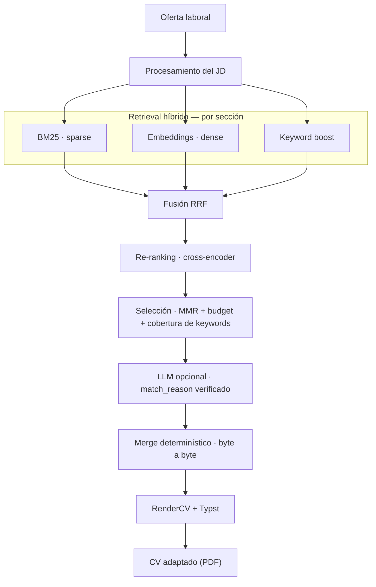

# cv-adapter

[](https://www.python.org/)
[](#tests)

> Adaptador de CV a ofertas laborales. Le pegás el texto de una oferta y el
> sistema elige, de tu CV maestro completo, qué experiencias, proyectos y
> skills mostrar (con qué keywords, en qué orden) para esa oferta puntual.
> Corre local: nada de tu CV sale a un servicio externo salvo que
> vos elijas usar una API remota para una parte muy chica del proceso.

<p align="center">
  
</p>

**La idea central:** la selección de contenido la hace un pipeline de
*information retrieval* clásico (BM25 + embeddings + re-ranking), no un
LLM. El LLM es opcional y, cuando se usa, queda acotado a redactar una
frase de "por qué elegí este bullet" (nunca el bullet en sí) con
verificación en código después. Cada línea que termina en el PDF salió,
copiada tal cual, del CV maestro.

## Índice

- [Por qué lo armé así](#por-qué-lo-armé-así)
- [Qué hace](#qué-hace)
- [Motor de recuperación](#motor-de-recuperación)
- [Stack](#stack)
- [Instalación rápida](#instalación-rápida)
- [Estructura del proyecto](#estructura-del-proyecto)
- [Tests](#tests)
- [Decisiones y límites](#decisiones-y-límites)

## Por qué lo armé así

Pegar el CV entero en un chat genérico tiene tres problemas:
el modelo puede inventar una tecnología o un logro que nunca tuviste, no
hay forma de saber *por qué* priorizó un bullet sobre otro, y tu CV
(teléfono, mails, ex-empleadores) termina en los logs de un proveedor.

Por eso la selección de contenido la hace un motor de búsqueda 
determinístico, rápido, corre local, y explicable ("elegí este bullet
porque menciona X, que también aparece en la oferta"). El LLM entra recién
al final, solo para pulir redacción, nunca para decidir contenido.

## Qué hace

- **Selecciona contenido relevante** de un CV maestro para cada oferta:
  experiencia, proyectos, skills y el resumen que mejor matchea.
- **Explica cada elección**: qué fragmento de la oferta la justifica y un
  score de relevancia visible.
- **Chequea keywords ATS**: qué cubrís, qué tenés pero no entró por
  presupuesto de página, y qué directamente no tenés.
- **Separa hechos de redacción**: acción, herramientas y resultados
  quedan aparte del texto final, para tener varias versiones del mismo
  logro sin reescribir nada a mano.
- **Importa CVs viejos**: agrupa por similitud los logros que son el
  mismo, redactado distinto.
- **Lleva historial**: cada corrida queda con su análisis ATS, para
  comparar y ver qué keywords se repiten oferta tras oferta.

## Motor de recuperación

Es la pieza que hace el trabajo real del proyecto. Corre **por sección** (`experience`, `projects`,
`skills`, `education` tienen cada una su propio índice) el retrieval
nunca compite bullets de secciones distintas entre sí.



**1. Tres canales de retrieval en paralelo, por sección**
- *Sparse*: BM25 (`rank-bm25`) con diccionario de sinónimos técnicos
  curado (`k8s` → `kubernetes`, etc.) y stemming Snowball ES/EN opcional.
- *Dense*: `intfloat/multilingual-e5-small`. Cada bullet se compara
  contra todos los chunks del JD y se queda con la similitud máxima
  (Max-Sim / late interaction) en vez de mean-pooling, para no diluir el
  vector del JD.
- *Keyword-boost*: match literal contra keywords técnicas detectadas en
  el JD, con menor peso que los otros dos canales por default.

**2. Fusión y re-ranking**
- Reciprocal Rank Fusion (RRF) combina los tres rankings con pesos
  configurables por canal. La constante `k` está ajustada para corpus de
  decenas de bullets por sección, no miles. Con el `k` típico de la
  literatura las diferencias de rank se aplanan de más.
- Un cross-encoder (`cross-encoder/mmarco-mMiniLMv2-L12-H384-v1`,
  CPU-only) re-scorea el top-30 de la fusión contra el JD completo. Es el
  paso más caro, así que corre solo sobre esos candidatos y se cachea por
  hash de `(oferta, CV maestro, config de retrieval)`.

**3. Selección**
- MMR (Maximal Marginal Relevance) evita que los N bullets de mayor score
  de una entrada digan lo mismo con otras palabras.
- El presupuesto de página se aplica siempre en código.
- Cobertura global de keywords críticas: si una keyword frecuente en el
  JD solo vive en una entrada excluida por presupuesto, se hace un swap
  acotado para rescatarla (salvo que esté negada en la oferta).
- Un bullet que matchea un término que el JD excluye explícitamente no se
  descarta, pero su score baja (penalización por negación).

**4. LLM opcional, con verificación**
El LLM recibe solo el JD + los bullets ya elegidos por IR (~2K tokens,
nunca el CV entero) y puede redactar el `match_reason` o sugerir qué
variante de redacción ya existente usar pero nunca escribe contenido nuevo.
Cada `match_reason` se verifica: si menciona algo que no está ni en el
bullet ni en el JD, se descarta y queda el motivo determinístico de IR.
Si el proveedor falla, el pipeline degrada a selección de IR
pura.

**5. Merge determinístico**
`src/merge.py` copia texto byte a byte desde `master_cv.yaml`. El LLM
solo puede devolver *índices* a contenido existente. Un índice inválido
se ignora, nunca se inventa contenido de reemplazo.

Detalle completo (procesamiento de JD, HyDE opcional, eval harness) en
[`docs/ARCHITECTURE.md`](docs/ARCHITECTURE.md).

## Stack

| Capa | Tecnología |
|---|---|
| Backend | FastAPI + Pydantic |
| Retrieval léxico | `rank-bm25` + sinónimos curados + stemming Snowball ES/EN |
| Retrieval denso | `sentence-transformers` (`intfloat/multilingual-e5-small`), late interaction |
| Re-ranking | Cross-encoder `cross-encoder/mmarco-mMiniLMv2-L12-H384-v1`, CPU-only |
| Fusión | Reciprocal Rank Fusion con pesos por canal |
| LLM (opcional) | Ollama local o cualquier API compatible con OpenAI |
| Render final | RenderCV + Typst |
| Frontend | JavaScript vanilla, ES modules |
| Persistencia | YAML (CVs) + JSON (historial, sesiones) |

## Instalación rápida

```bash
# 1. Modelo local con Ollama (opcional — se puede usar una API remota, ver abajo)
ollama pull llama3:8b
ollama serve

# 2. Entorno Python
python3 -m venv .venv
source .venv/bin/activate        # Windows: .venv\Scripts\activate
pip install -r requirements.txt

# 3. Levantar
uvicorn app:app --reload
```

Abrí `http://127.0.0.1:8000`. Cuatro pestañas: **CV maestro**, **Nueva
aplicación**, **Historial** y **Configuración** (más **Importar** para
migrar CVs viejos).

En Configuración se puede elegir un
proveedor remoto compatible con OpenAI (OpenAI, OpenRouter, Groq...) y
pegar su API key, o setear `OPENAI_API_KEY` como variable de entorno. Sin
ningún proveedor configurado, la app funciona igual con selección de IR
pura, sin las frases de justificación redactadas por LLM.

**Probarlo con un CV de ejemplo:**

```bash
cp data/master_cv_example.yaml data/master_cv.yaml
```

Abrí **Nueva aplicación** y pegá el contenido de
`data/job_description_example.txt`.

## Estructura del proyecto

```
cv-adapter/
├── app.py                     # entry point de uvicorn
├── api/                        # FastAPI: routers, schemas
├── src/
│   ├── retrieval/               # motor de búsqueda híbrido (ver ARCHITECTURE.md)
│   ├── selection.py              # orquesta la selección de contenido
│   ├── merge.py                  # arma el YAML final, determinístico
│   ├── llm_node.py                # fase LLM opcional, con verificación
│   ├── achievements.py            # logros con hechos + variantes de redacción
│   ├── importer.py                # importación y agrupado de CVs viejos
│   └── history.py                 # historial de corridas
├── frontend/                   # JS vanilla, sin build step
├── scripts/eval_retrieval.py   # eval harness del motor de búsqueda
└── tests/                      # pytest
```

Los knobs finos del ranking (pesos por canal, umbral de diversidad,
penalización por negación, activar/desactivar re-ranker o stemming) hoy se
tocan editando `config.json` o mediante la pestaña **Configuración** de la UI.

```bash
python scripts/eval_retrieval.py --master data/master_cv_example.yaml
```

compara configuraciones del motor de búsqueda contra un set de evaluación.

## Tests

```bash
pytest
```

Cubre el pipeline de búsqueda, el merge determinístico y sus invariantes
anti-alucinación, el modelo de logros con variantes, la importación con
agrupado automático, y la API completa.
