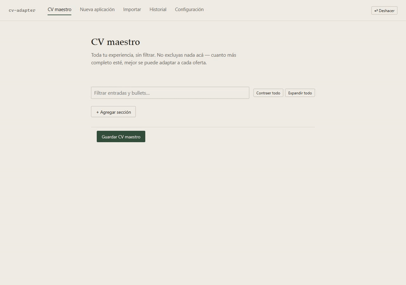
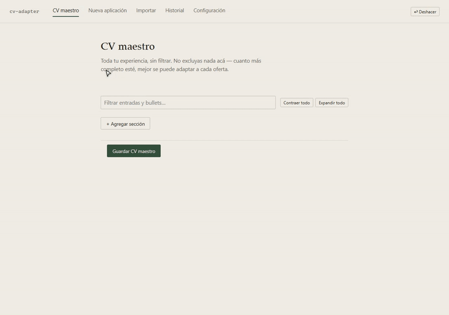

# cv-adapter

### Adaptador de CV con IR híbrido + LLM opcional — 100% local, $0, sin alucinaciones

<p align="center">
  
  
  
  
  
  
  
</p>

<p align="center">
  
  <br>
  <sub><em>Flujo completo: pegar oferta → revisar selección → descargar PDF</em></sub>
</p>

**cv-adapter** pega una oferta laboral y elige — de tu CV maestro completo —
qué experiencias, proyectos, logros y skills mostrar, con qué keywords ATS,
en el orden que más matchea con esa oferta específica. Todo corre en tu
máquina: sin SaaS, sin suscripción, sin mandar tu CV a ningún lado que no
elijas vos.

La pieza que lo distingue de "pegarle tu CV a ChatGPT": el LLM **nunca
redacta el documento final**. Un motor de *information retrieval* híbrido
(BM25 + embeddings + cross-encoder + RRF) hace la selección real, de forma
determinística y explicable; el LLM, si se usa, es opcional y queda
confinado a tareas de bajo riesgo con verificación anti-alucinación en
código. Ver [Garantías](#-garantías-anti-alucinación) más abajo.

---

## Índice

- [¿Por qué existe esto?](#-por-qué-existe-esto)
- [Funcionalidades](#-funcionalidades)
- [Arquitectura del pipeline](#-arquitectura-del-pipeline)
- [Garantías anti-alucinación](#-garantías-anti-alucinación)
- [Stack](#-stack)
- [Instalación rápida](#-instalación-rápida)
- [Estructura del proyecto](#-estructura-del-proyecto)
- [Configuración avanzada](#-configuración-avanzada)
- [Limitaciones conocidas](#-limitaciones-conocidas)
- [Tests](#-tests)
- [Licencia](#-licencia)

---

## 🤔 ¿Por qué existe esto?

Adaptar un CV a mano para cada oferta es lento y repetitivo. Pegarlo entero
en un chat de IA genérico es rápido, pero:

- el modelo **inventa** logros, tecnologías o métricas que nunca pusiste,
- no hay forma de saber **por qué** priorizó un bullet sobre otro,
- tu CV termina en los logs de un proveedor externo,
- y el resultado casi nunca entra en una página sin retocar el layout a mano.

`cv-adapter` ataca los cuatro problemas con **código determinístico**, no
con más prompt: la selección de contenido la hace un pipeline de retrieval
clásico (no un LLM), cada bullet queda copiado *byte a byte* del CV maestro,
cada keyword ATS mostrada se verifica que exista de verdad en tu experiencia,
y el presupuesto de una página se aplica con código — nunca confiando en
que un modelo de 8B "se porte bien" con una instrucción de brevedad.

## ✨ Funcionalidades

### 🎯 Selección de contenido explicable, no una caja negra
Cada bullet elegido para el CV generado muestra **por qué** matchea con la
oferta (el fragmento del JD que lo justificó) y un score de relevancia
visual. Lo que no entró por presupuesto de página queda igual disponible
en un panel de "contenido excluido", con un botón para traerlo manualmente.

<p align="center">
  
  <br>
  <sub><em>Vista "Nueva aplicación": keyword report, scores por bullet, tooltip con el fragmento de la oferta</em></sub>
</p>

### 📝 Logros con variantes de redacción
En vez de un bullet-string fijo, cada logro separa los **hechos**
verificables (acción, herramientas, resultados medibles) de sus
**variantes de redacción**, cada una orientada a un ángulo distinto
(liderazgo, impacto técnico, reducción de costos...). El motor de
retrieval elige, automáticamente, qué variante mostrar según qué ángulo
matchea mejor con cada oferta.

<p align="center">
  
  <br>
  <sub><em>Editor de logros: hechos, variantes por ángulo, "usada en N CVs", enriquecer un bullet legacy</em></sub>
</p>

### 🤖 Generación asistida de una redacción nueva, bajo aprobación humana
Si ningún bullet existente sirve para el ángulo que mejor matchea una
oferta, un botón inline le pide al LLM una redacción nueva **usando solo
los hechos ya cargados** del logro. El resultado se muestra lado a lado
con la redacción actual, con los términos técnicos no verificables
resaltados — nada se aplica sin que el usuario elija explícitamente
"usar" o "descartar".

<p align="center">
  
  <br>
  <sub><em>Botón ✏ en un bullet con logro → comparación lado a lado → "usar y guardar"</em></sub>
</p>

### 📥 Importación masiva de CVs viejos
Subís varios PDFs/YAML/texto a la vez, el sistema agrupa por embeddings
los bullets que probablemente son el mismo logro redactado distinto
(con protección contra el "bullet embudo" que encadenaría todo el
documento en un cluster), y una bandeja de revisión te deja confirmar,
separar o descartar cluster por cluster.

<p align="center">
  
  <br>
  <sub><em>Subir CVs → bandeja de clusters con diff resaltado → confirmar logros importados</em></sub>
</p>

### 🕓 Historial, ATS score y seguimiento de postulaciones
Cada corrida queda registrada con su análisis ATS, el PDF asociado y el
seguimiento de la aplicación (estado, fecha, notas). Las keywords que las
ofertas piden y nunca están en tu CV maestro se agregan entre todas las
corridas, para detectar patrones ("terraform" aparece en 8 de tus últimas
10 ofertas y no está en tu CV — quizás valga la pena agregarlo).

<p align="center">
  
  <br>
  <sub><em>Historial: filtros, estado de aplicación, comparar dos corridas, variantes más usadas</em></sub>
</p>

### 💬 Arrancar de cero sin miedo a la hoja en blanco
Si todavía no cargaste ningún logro, un onboarding conversacional
pregunta una cosa a la vez ("¿qué hiciste?", "¿con qué herramientas?",
"¿algún resultado medible?") en vez de mostrar un formulario vacío con
conceptos como *facts*/*outcomes* desde el primer segundo.

---

## 🧠 Arquitectura del pipeline

Lo que pasa entre "pegar una oferta laboral" y "obtener el CV adaptado":
un motor de *information retrieval* híbrido por sección del CV (BM25 +
embeddings densos + keyword-boost, fusionados con Reciprocal Rank Fusion
y re-rankeados con un cross-encoder), con una fase de LLM opcional acotada
a tareas de bajo riesgo, y un merge 100% determinístico al final.

```
                  ┌────────────────────────────────────────────────────────────┐
                  │           SOLICITUD: GENERAR CV PARA UNA OFERTA            │
                  └────────────────────────────────────────────────────────────┘
                                                │                                                 
                                                ▼                                                 
┌────────────────────────────────────────────────────────────────────────────────────────────────┐
│        SELECTION ENGINE — Pipeline de Information Retrieval Híbrido (src/selection.py)         │
├────────────────────────────────────────────────────────────────────────────────────────────────┤
│                                                                                                │
│   ┌──────────────────────────────────────────────────────────────────────────────────────────┐ │
│   │ PROCESAMIENTO DEL JD                                                                     │ │
│   ├──────────────────────────────────────────────────────────────────────────────────────────┤ │
│   │   · extract_requirements_section — recorta heurísticamente la sección de requisitos      │ │
│   │   · chunk_text — ventana deslizante de 200 tokens (overlap 50) para no truncar el JD     │ │
│   │   · extract_negated_terms — detecta "no se requiere X" en el JD                       │ │
│   │   · HyDE (opcional) — CV hipotético del LLM antepuesto a los chunks del JD            │ │
│   └──────────────────────────────────────────────────────────────────────────────────────────┘ │
│                                                                                                │
│   ▼                                                                                            │
│                                                                                                │
│   ┌──────────────────────────────────────────────────────────────────────────────────────────┐ │
│   │ FUENTES DE CANDIDATOS — por sección (experience / projects / skills / education)         │ │
│   ├──────────────────────────────────────────────────────────────────────────────────────────┤ │
│   │ ┌──────────────────────────┐  ┌──────────────────────────┐  ┌──────────────────────────┐ │ │
│   │ │          SPARSE          │  │          DENSE           │  │      KEYWORD BOOST       │ │ │
│   │ ├──────────────────────────┤  ├──────────────────────────┤  ├──────────────────────────┤ │ │
│   │ │ BM25 Okapi               │  │ multilingual-e5-small    │  │ match literal contra     │ │ │
│   │ │ sinónimos técnicos       │  │ Late Interaction         │  │ keywords ATS del JD      │ │ │
│   │ │ (k8s→kubernetes...)      │  │ (Max-Sim vs los          │  │ (con sinónimos y         │ │ │
│   │ │ stemming ES/EN           │  │ chunks del JD)           │  │ límites de palabra)      │ │ │
│   │ └──────────────────────────┘  └──────────────────────────┘  └──────────────────────────┘ │ │
│   └──────────────────────────────────────────────────────────────────────────────────────────┘ │
│                                                                                                │
│   ▼                                                                                            │
│                                                                                                │
│   ┌──────────────────────────────────────────────────────────────────────────────────────────┐ │
│   │ FUSIÓN — Reciprocal Rank Fusion (RRF)                                                    │ │
│   ├──────────────────────────────────────────────────────────────────────────────────────────┤ │
│   │   · combina los 3 rankings con pesos configurables por canal (sparse/dense/keyword)      │ │
│   │   · k ajustado a corpus chicos (default 15; el k=60 de la literatura es para TREC)       │ │
│   └──────────────────────────────────────────────────────────────────────────────────────────┘ │
│                                                                                                │
│   ▼                                                                                            │
│                                                                                                │
│   ┌──────────────────────────────────────────────────────────────────────────────────────────┐ │
│   │ RE-RANKING — Cross-Encoder (CPU)                                                         │ │
│   ├──────────────────────────────────────────────────────────────────────────────────────────┤ │
│   │   · cross-encoder/mmarco-mMiniLMv2-L12-H384-v1                                           │ │
│   │   · re-scorea el top-30 de la fusión contra el JD completo                               │ │
│   └──────────────────────────────────────────────────────────────────────────────────────────┘ │
│                                                                                                │
│   ▼                                                                                            │
│                                                                                                │
│   ┌──────────────────────────────────────────────────────────────────────────────────────────┐ │
│   │ SELECCIÓN                                                                                │ │
│   ├──────────────────────────────────────────────────────────────────────────────────────────┤ │
│   │   · MMR (Maximal Marginal Relevance) — diversidad de bullets, evita redundancia          │ │
│   │   · presupuesto de página — máx. entradas/bullets por config (código, no por prompt)     │ │
│   │   · cobertura global de keywords críticas — swap de entradas si alguna queda afuera      │ │
│   │   · penalización por negación — baja el rank de lo que el JD excluye explícitamente      │ │
│   └──────────────────────────────────────────────────────────────────────────────────────────┘ │
│                                                                                                │
└────────────────────────────────────────────────────────────────────────────────────────────────┘
                                                │                                                 
                                                ▼                                                 
  ┌────────────────────────────────────────────────────────────────────────────────────────────┐
  │ FASE ESTRATÉGICA — LLM (Ollama local u API remota, OPCIONAL)                               │
  ├────────────────────────────────────────────────────────────────────────────────────────────┤
  │   · recibe SOLO el JD + los bullets ya elegidos por IR (~2K tokens, nunca el CV entero)    │
  │   · puede: redactar mejores match_reason, sugerir preferred_angles por logro               │
  │   · NO puede: tocar índices, keywords ni la selección de IR (guardrail de código)          │
  │   · cada match_reason se verifica anti-alucinación antes de aceptarse                      │
  │   · si el proveedor falla o tarda → degrada con gracia y queda la selección de IR pura     │
  └────────────────────────────────────────────────────────────────────────────────────────────┘
                                                │                                                 
                                                ▼                                                 
  ┌────────────────────────────────────────────────────────────────────────────────────────────┐
  │ MERGE DETERMINÍSTICO — src/merge.py (cero LLM acá)                                         │
  ├────────────────────────────────────────────────────────────────────────────────────────────┤
  │   · copia texto BYTE A BYTE desde master_cv.yaml — el LLM nunca redacta el YAML final      │
  │   · keywords ATS verificadas: sobreviven solo si existen en el master Y en la oferta       │
  │   · límites de una página aplicados con código, nunca confiando en que el LLM obedezca     │
  └────────────────────────────────────────────────────────────────────────────────────────────┘
                                                │                                                 
                                                ▼                                                 
                       ┌──────────────────────────────────────────────────┐
                       │            RENDER — RenderCV + Typst             │
                       ├──────────────────────────────────────────────────┤
                       │               target_cv.yaml → PDF               │
                       └──────────────────────────────────────────────────┘
                                                │                                                 
                                                ▼                                                 
      ┌────────────────────────────────────────────────────────────────────────────────────┐
      │      RESPUESTA: CV ADAPTADO (PDF) + REPORTE ATS + RAZONES DE MATCH POR BULLET      │
      └────────────────────────────────────────────────────────────────────────────────────┘
```

**Puntos clave del diseño:**

- **Cada sección del CV (experiencia, proyectos, skills, educación) tiene
  su propio índice** BM25 + embeddings — el retrieval no compite bullets
  de secciones distintas entre sí.
- **RRF en vez de un score único**: combinar rankings (en vez de sumar
  scores heterogéneos) evita que un canal con una escala de valores
  distinta domine artificialmente a los otros.
- **MMR (diversidad) antes que puro top-N por score**: sin esto, los N
  bullets de mayor score de una entrada suelen decir lo mismo con otras
  palabras, desperdiciando presupuesto de página.
- **Cache de selección**: la fase de IR (el paso caro — embeddings +
  cross-encoder) se cachea por hash de `(oferta, CV maestro, config)`,
  así que regenerar la misma oferta o pedir "regenerar sección" no vuelve
  a pagar ese costo.
- **El LLM es prescindible en todo momento**: si el proveedor está caído o
  no hay API key configurada, el pipeline degrada con gracia a la
  selección de IR pura — nunca rompe, nunca bloquea.

## 🛡 Garantías anti-alucinación

La razón por la que el LLM (cuando se usa) nunca toca el documento final:

| Guardrail | Cómo se aplica |
|---|---|
| El YAML final nunca lo redacta el LLM | `merge.py` copia texto **byte a byte** desde el CV maestro; el LLM solo puede devolver *índices* a contenido que ya existe |
| Índices inválidos se ignoran | Nunca se inventa contenido de reemplazo — un índice fuera de rango simplemente no se usa |
| Keywords ATS verificadas en ambos lados | Una keyword solo sobrevive si existe (o una variante sinónima) en el CV maestro **y** en la oferta |
| `match_reason` verificado | Si el LLM menciona una tecnología que no está ni en el bullet ni en el JD, se descarta y queda el motivo determinístico de IR |
| Términos técnicos de variantes generadas verificados | Al generar una redacción nueva, cada término técnico se chequea contra los *hechos* del logro; lo no verificable se resalta, nunca se oculta |
| Presupuesto de una página forzado por código | `config.json` define los límites; se aplican siempre, sin importar cuánto contenido devuelva el modelo |

## 🧰 Stack

| Capa | Tecnología |
|---|---|
| Backend | FastAPI + Pydantic |
| Retrieval léxico | `rank-bm25` + sinónimos técnicos curados + stemming Snowball ES/EN |
| Retrieval denso | `sentence-transformers` (`intfloat/multilingual-e5-small`), Late Interaction (Max-Sim) |
| Re-ranking | Cross-encoder (`cross-encoder/mmarco-mMiniLMv2-L12-H384-v1`), CPU-only |
| Fusión | Reciprocal Rank Fusion con pesos configurables por canal |
| LLM (opcional) | Ollama local **o** cualquier API compatible con OpenAI (OpenAI, OpenRouter, Groq...) |
| Render final | [RenderCV](https://github.com/rendercv/rendercv) + Typst (sin LaTeX) |
| Frontend | JavaScript vanilla, ES modules nativos — **sin bundler, sin build step** |
| Persistencia | YAML (CV maestro/target) + JSON (historial, sesiones de importación) — sin base de datos |

## 🚀 Instalación rápida

```bash
# 1. Ollama (modelo local) — o saltealo y usá una API remota, ver más abajo
ollama pull llama3.1:8b
ollama serve

# 2. Entorno Python
python3 -m venv .venv
source .venv/bin/activate        # Windows: .venv\Scripts\activate
pip install -r requirements.txt

# 3. Levantar
uvicorn app:app --reload
```

Abrí `http://127.0.0.1:8000`. Cuatro pestañas: **CV maestro**,
**Nueva aplicación**, **Historial**, **Configuración** (+ **Importar**
para migrar CVs viejos).

> **¿Preferís una API remota en vez de un modelo local?** No hace falta
> instalar nada extra: en la pestaña Configuración elegí el proveedor
> (OpenAI, OpenRouter, o cualquier endpoint compatible) y pegá tu API key.
> Si el proveedor falla o no configuraste ninguno, la app sigue funcionando
> con la selección de IR pura (sin `match_reason` redactado por LLM).
>
> - Alternativa sin key en disco: seteá la variable de entorno
>   `OPENAI_API_KEY`. Si está definida, tiene **prioridad** sobre el valor
>   de `config.json` y no se persiste en ningún archivo (útil en CI,
>   contenedores o despliegues).

### Probarlo con datos de ejemplo (sin cargar tu CV real)

```bash
cp data/master_cv_example.yaml data/master_cv.yaml
```

Abrí la app, pestaña **Nueva aplicación**, y pegá el contenido de
`data/job_description_example.txt`. Con eso ya podés ver el pipeline
completo funcionando de punta a punta antes de cargar tu propia
experiencia.

## 📁 Estructura del proyecto

```
cv-adapter/
├── app.py                    # entry point de uvicorn
├── api/                      # FastAPI: routers, schemas, deps
├── src/
│   ├── retrieval/            # BM25, denso, RRF, cross-encoder, keywords, JD processing
│   ├── selection.py          # SelectionEngine — orquesta el pipeline de IR
│   ├── merge.py              # fusión determinística master → target
│   ├── llm_node.py           # fase LLM estratégica (opcional, con guardrails)
│   ├── achievements.py       # modelo de logros con variantes
│   ├── importer.py           # importación + clustering de CVs viejos
│   ├── history.py            # historial de corridas y seguimiento
│   └── config.py             # config.json: defaults + validación
├── frontend/
│   ├── js/                   # ES modules nativos, sin bundler
│   └── style.css
├── scripts/
│   └── eval_retrieval.py     # eval harness (recall@10 / MRR@10) para tunear retrieval
├── docs/
│   └── media/                          # GIFs/capturas de este README
├── tests/                    # pytest — ver sección Tests
└── data/                     # CV maestro, historial (gitignored salvo *_example.*)
```

## ⚙️ Configuración avanzada

Los límites de página, el proveedor del LLM y los *knobs* del motor de
retrieval (peso de cada canal en la fusión, `k` de RRF, umbral de
diversidad, penalización por términos negados, stemming on/off, HyDE...)
viven en `config.json` y son editables desde la pestaña **Configuración**
sin tocar código. Para tunear el retrieval con datos propios:

```bash
python scripts/eval_retrieval.py --master data/master_cv_example.yaml
```

El harness compara canales aislados (sparse/dense/keywords) y distintas
configuraciones de fusión contra un set de evaluación, reportando
`recall@10` y `MRR@10` por config.

## ⚠️ Limitaciones conocidas

- **Primer uso:** descarga los modelos de embeddings/reranker desde
  HuggingFace y Typst baja paquetes la primera vez que renderiza — necesita
  internet solo esa primera vez, después el resto del pipeline es 100%
  local/offline.
- **Estimación de una página:** es una heurística de aviso (conteo
  aproximado de líneas), no un cálculo exacto — el layout real lo decide
  Typst según el tema elegido.
- **Proyecto de un solo usuario, pensado para correr en `localhost`:** no
  tiene capa de autenticación; no lo expongas en una red pública sin
  agregar una delante.

## 🧪 Tests

```bash
pytest
```

Suite de 270+ tests cubriendo el pipeline de IR (BM25, sinónimos,
stemming, RRF, cache de selección), el merge determinístico y sus
invariantes anti-alucinación, el modelo de logros con variantes, la
importación con clustering, y la API completa (FastAPI `TestClient`).

## 📄 Licencia

[MIT](LICENSE) — usalo, forkealo, adaptalo.

---

<p align="center"><sub>Hecho por <strong>[tu nombre]</strong> · <a href="https://github.com/tu-usuario">GitHub</a> · <a href="https://www.linkedin.com/in/tu-usuario">LinkedIn</a></sub></p>